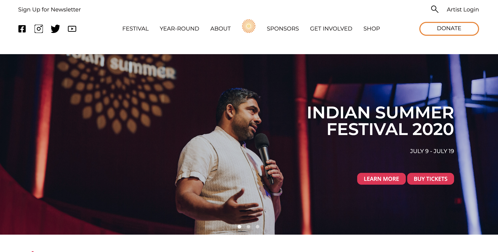
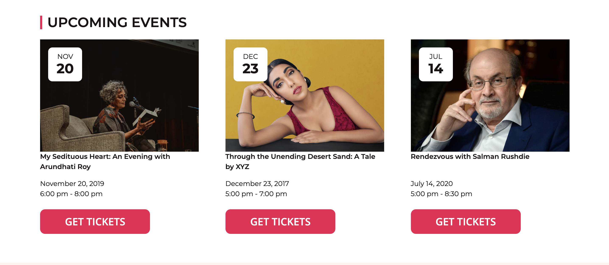
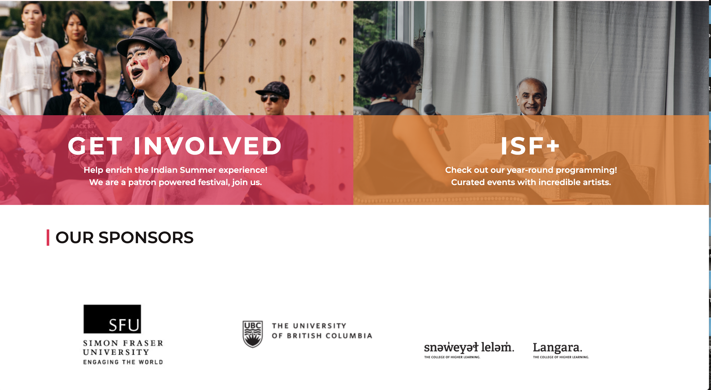

# Indian Summer Festival

## Community Project

### Project Descriptions

The project is built on base the Word Press custom Underscores Theme for the Non-profit company. Wordpress is used as a content management system. The project is demonstrating the effective use of combinations of different technologies. For more information see section (#Technologies Used)!





## Installations

In VS code Terminal run the following:

```
git init....
```

```
npm install....
```

## Key Learnings

- WordPress Functions
- WordPress Custom Loops
- WordPress Database
- WordPress Underscores Theme
- WordPress Customs Plug-ins
- PHP and his structure
- WP_Query and get_posts
- Installing and using Gulp
- Applying SASS structure
- Working with the Git
- Java Vanilla and Jquery

# Technologies Used

- HTML
- Css
- Sass
- Java Script
- jQuery
- aJax
- PHP
- Word Press
- Package.jason Version "1.1.0"

## Plugins and Installations

- WP SVG images
- Show Current Template
- WP Migrate DB Pro

1. Upload the plugin files to the `/wp-content/plugins/plugin-name` directory, or install the plugin through the WordPress plugins screen directly.
1. Activate the plugin through the 'Plugins' screen in WordPress
1. Use the Settings->Plugin Name screen to configure the plugin
1. (Make your instructions match the desired user flow for activating and installing your plugin. Include any steps that might be needed for explanatory purposes)

## The list of features this site offers are as followed:

-Display events filtered through categories
-Responsive Web design to view on screens of all sizes
-User Friendly navigation experience

## Personal Learnings

The project is focused on creating a Custom Community Project Web Site in WordPress site-building and content management system in team setting. During this project we were able to cooperate between two working teams from the Web Development and UI/UX Designer Programs.

# Author:

Ken Huang,
Kristine Suarez,
Abdullah Rahman,
Michal Prokop,
Web developer students at Red Academy
Vancouver, Canada, BC
